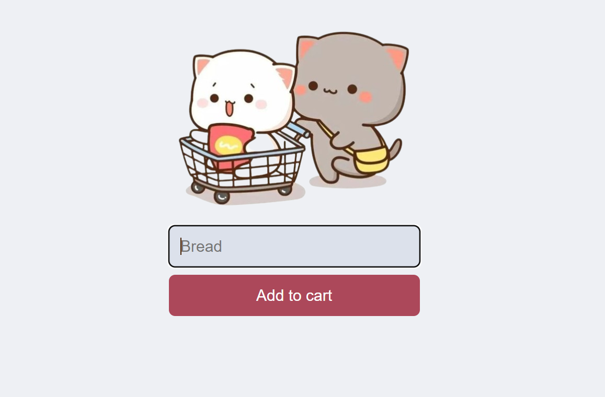
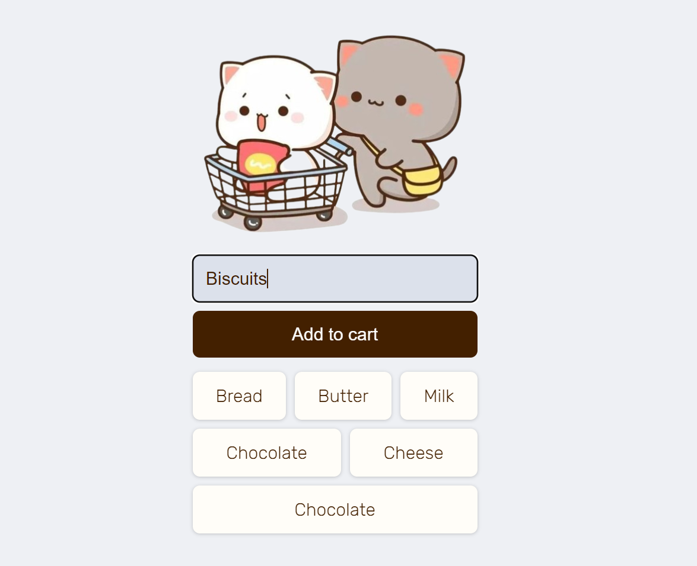
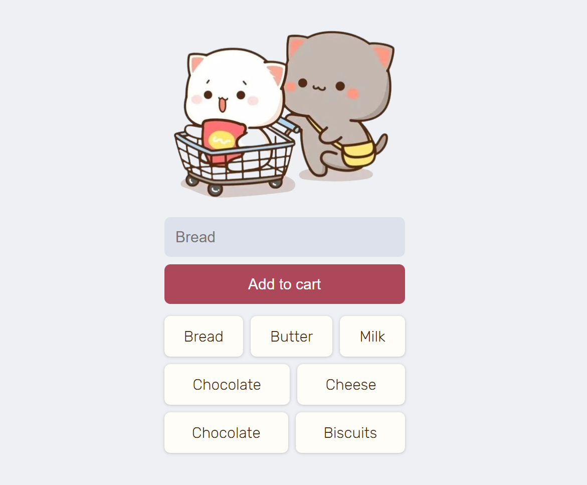

# 🛒 Add to Cart

A simple web app that allows users to add items to a shopping list and save them to a Firebase Realtime Database. Items can be double-clicked to remove them from the list.

## ✨ Features
- ➕ Add items to a shopping list
- ☁️ Save and sync items in real-time using Firebase
- ❌ Remove items by double-clicking
- 📱 Responsive UI with a minimal design

## 🚀 Installation

1. Clone the repository:
   ```bash
   git clone https://github.com/adithya-b-r/Firebase-Cart.git
   ```
2. Open the project folder.
3. Replace `"YOUR-DATABASE-URL"` in the `script.js` file with your Firebase Realtime Database URL.

## 🔧 Usage

1. Open `index.html` in your browser.
2. Enter an item in the input field and click **Add to cart**.
3. 📝 Items will appear in the list and will be saved in the Firebase database.
4. 🗑️ Double-click an item to remove it.

## 📂 Project Structure
- **index.html**: Basic structure of the web page.
- **style.css**: 🎨 Styling for the page layout and elements.
- **script.js**: 🔥 JavaScript file that handles Firebase integration and DOM manipulation.

## 🔥 Firebase Setup
1. Go to [Firebase Console](https://console.firebase.google.com/).
2. 🏗️ Create a project and add a Realtime Database.
3. Replace the `databaseURL` in `script.js` with your project’s database URL.

## 🛠️ Technologies Used
- HTML, CSS, JavaScript
- Firebase Realtime Database

## 👀 Preview

### 📸 Screenshot 1: Initial Interface


### 📸 Screenshot 2: Adding an Item


### 📸 Screenshot 3: Shopping List with Items
